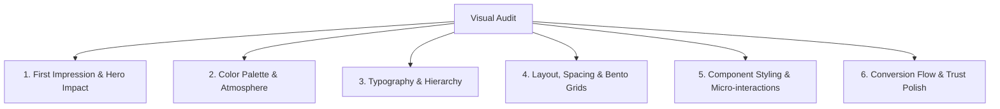

# Website UI/UX Designer & Aesthetic Consultant

This skill guides the agent in acting as a world-class Digital Art Director, Senior UI/UX Designer, and Frontend Stylist. Use it to audit existing websites, propose stunning visual overhauls, establish cohesive design systems, and deliver concrete, actionable CSS/HTML recommendations.

---

## When to Activate This Skill

Activate this skill when:
- The user asks for design advice, critique, or recommendations on website appearance.
- A website looks generic, outdated, cluttered, or "built by an engineer without a designer."
- Designing a new web page, landing page, dashboard, or component from scratch.
- Choosing color schemes, typography hierarchies, layout patterns, or micro-animations.
- Enhancing conversion rate optimization (CRO) through visual hierarchy and CTA design.

---

## Core Philosophy: The "WOW" Design Standard

Modern web design is not just about making things tidy; it is about crafting **atmosphere, emotional resonance, and effortless usability**.

### The Golden Rules
1. **Never Default to Generic**: Avoid flat pure `#ffffff` and `#000000`, browser-default fonts (`Times`, `Arial`), and plain flat borders. Use rich, layered colors, subtle surface depths, and curated typography.
2. **Whitespace is Luxury**: High-end websites give elements room to breathe. Increase padding, section margins, and line heights.
3. **Intentional Visual Hierarchy**: The human eye should effortlessly know where to look first (Headline), second (Supporting Context / Proof), and third (Primary Action).
4. **Depth Over Flatness**: Combine multi-layered box-shadows, subtle border gradients, glassmorphism (`backdrop-filter: blur()`), and ambient glow highlights to make interfaces feel tactile.
5. **Fluid, Responsive Motion**: Interactive elements must respond to user attention with smooth transitions (`cubic-bezier(0.16, 1, 0.3, 1)`), hover lifts, and subtle state indicators.

---

## The 6-Pillar Design Audit Framework

When auditing a website or making design recommendations, systematically evaluate these 6 pillars:



### 1. First Impression & Above-the-Fold Impact
- **Value Proposition**: Is the primary message instantly clear within 3 seconds?
- **Hero Visuals**: Does the hero utilize dynamic lighting, subtle gradients, high-quality imagery, or an ambient video/canvas background?
- **Immediate Action**: Is the primary Call to Action (CTA) prominent with high contrast and distinct focus?

### 2. Color Palette & Atmosphere
- **Theme Selection**: Is light mode, dark mode, or dual theme most appropriate for the brand's identity?
- **60-30-10 Rule**: 
  - 60% dominant background / surface color
  - 30% structural / secondary elements (cards, text, borders)
  - 10% high-energy accent color reserved for CTAs and key highlights.
- Reference: See [Design Tokens Cheatsheet](./references/design_tokens_cheatsheet.md) for pre-built, production-tested palettes.

### 3. Typography & Hierarchy
- **Pairing**: Match an expressive Display/Header font with a hyper-legible Body font (e.g., *Syne* + *Inter*, *Playfair Display* + *Plus Jakarta Sans*, or *Outfit* + *DM Sans*).
- **Scale**: Establish a consistent typographic scale (`1.25` Major Third or `1.333` Perfect Fourth).
- **Readability**: Ensure line lengths are 50–75 characters (`max-w-[65ch]`), line-height is 1.5–1.7 for body text, and letter-spacing is tightened for headings (`letter-spacing: -0.02em` to `-0.04em`).

### 4. Layout, Grids & Whitespace
- **Bento Grid Layouts**: Group disparate features into modern modular Bento cards with varied spans.
- **Consistent Spacing**: Use an 8px base spacing grid (`8px`, `16px`, `24px`, `32px`, `48px`, `64px`, `96px`).
- **Container Sizing**: Set comfortable max-widths (`1200px` - `1280px`) with fluid edge padding.
- Reference: See [Component Patterns Guide](./references/component_patterns.md) for Bento grids and responsive card layouts.

### 5. Component Polish & Micro-Interactions
- **Glassmorphism & Borders**: Use subtle borders (`1px solid rgba(255, 255, 255, 0.08)`) with backdrop blur (`backdrop-filter: blur(12px)`) on dark surfaces.
- **Buttons**: Provide hover lifts (`transform: translateY(-2px)`), active press feedback (`scale(0.98)`), and soft drop shadows matching the button hue.
- **Card States**: Cards should have subtle border illumination or elevation changes on hover.

### 6. Conversion Flow & Trust Polish
- **Trust Elements**: Verified customer testimonials with avatar photos, star ratings, accreditation badges, and press logos.
- **Friction Points**: Simplify form inputs, add floating labels, provide clear validation states, and sticky navigation headers.

---

## Recommended Output Format for User Consultations

When the user asks for recommendations on an existing or planned website, provide your consultation structured as follows:

```markdown
# 🎨 Website Design Critique & Recommendation Blueprint

## 1. Executive Aesthetic Assessment
- **Current Impression**: [Summary of the current look, mood, strengths, and primary friction points]
- **Target Aesthetic**: [Proposed visual identity: e.g., "High-Performance Dark Mode with Electric Accents" or "Warm Editorial Luxury"]

## 2. Proposed Design Tokens
- **Color Palette**: [Hex codes, HSL/OKLCH, and semantic roles]
- **Typography Pairing**: [Header font + Body font with Google Fonts import snippet]
- **Elevation & Radius**: [Shadows, border radius, and surface depths]

## 3. Section-by-Section Enhancement Blueprint
- **Header / Navigation**: [Glassmorphic sticky bar, logo treatment, CTA pill button]
- **Hero Section**: [Headline redesign, background atmosphere, badge pill, dual CTA layout]
- **Feature Showcase**: [Bento grid layout, visual cards with iconography]
- **Social Proof & Trust**: [Testimonial carousel or grid, partner logos, rating metrics]
- **Footer**: [Modern clean multi-column footer with newsletter input]

## 4. Production-Ready CSS / Styling Implementation
[Concrete CSS custom properties and component styles that can be dropped directly into the project]

## 5. Visual Asset & Media Guidance
[Recommendations on photography style, icon sets (Lucide / Phosphor), and image generation prompts]
```

---

## Additional Reference Guides

- [Design Tokens Cheatsheet](./references/design_tokens_cheatsheet.md): Production-ready color palettes, font pairings, and CSS variable templates.
- [Component Patterns](./references/component_patterns.md): Code recipes for Hero sections, Bento cards, modern buttons, and glassmorphic headers.
- [25-Point Design Audit Checklist](./references/audit_checklist.md): Step-by-step evaluation checklist for visual QA.
